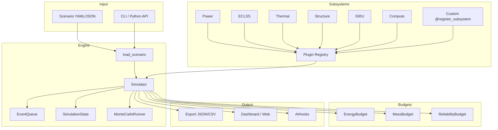
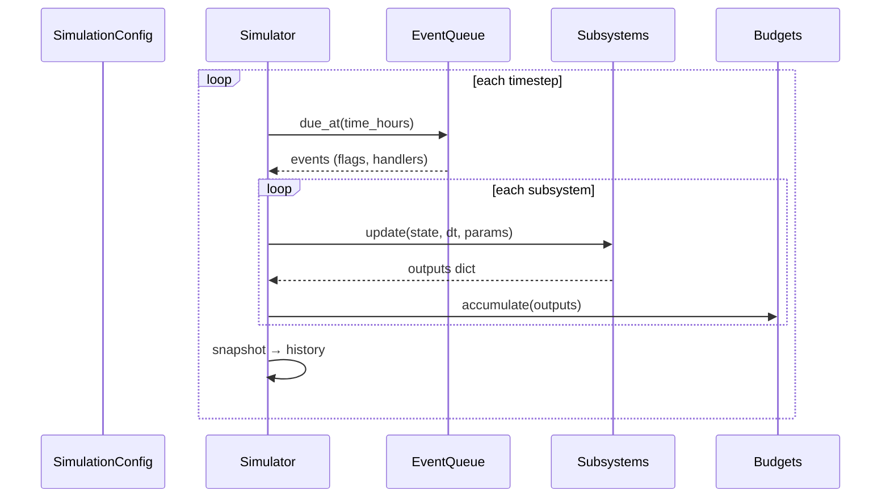
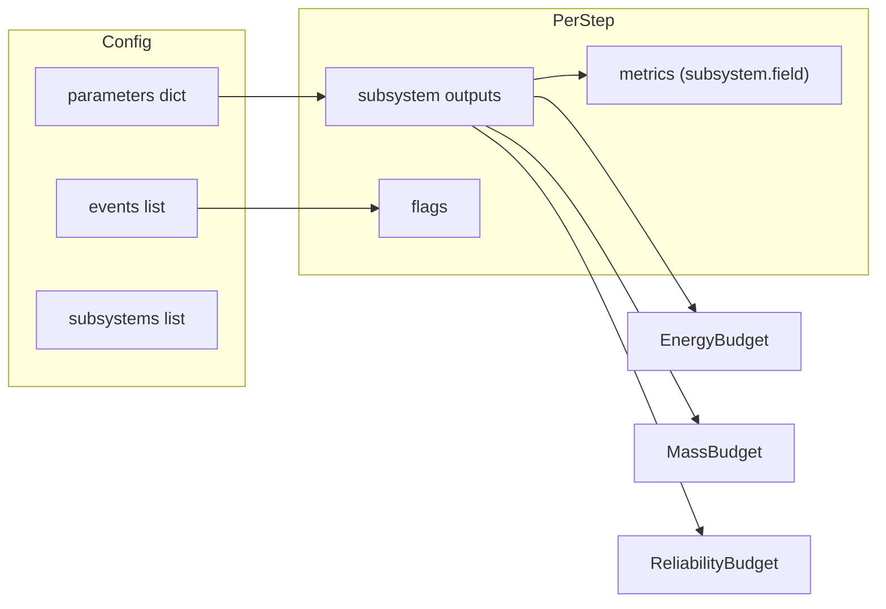

# AstroSim Architecture

AstroSim is a modular, time-stepped simulation framework for space habitat modeling. This document describes the core engine, subsystems, budgeting, events, and plugin system.

## High-Level Overview



## Simulation Loop

Each timestep follows a fixed order:

1. **Advance time** — set `state.time_hours` and `state.step` from `SimulationConfig`.
2. **Process events** — `EventQueue.due_at()` fires scheduled events; payloads become `state.flags`.
3. **Update subsystems** — each registered subsystem runs `update(state, dt, params)` and returns metric outputs.
4. **Record state** — outputs are stored in `state.subsystem_outputs` and flattened to `state.metrics` as `subsystem.field`.
5. **Accumulate budgets** — energy, mass, and reliability trackers ingest subsystem outputs.
6. **Snapshot** — a copy of `SimulationState` is appended to `history`.



## Core Components

### Engine (`src/astrosim/engine/`)

| Module | Responsibility |
|--------|----------------|
| `simulator.py` | `Simulator` orchestrates the timestep loop; returns `SimulationResult`. |
| `state.py` | `SimulationState` (mutable per-step) and `SimulationConfig` (immutable run config). |
| `events.py` | `SimulationEvent` and `EventQueue` for scheduled triggers. |
| `monte_carlo.py` | `MonteCarloRunner` perturbs parameters and aggregates statistics. |

### Subsystems (`src/astrosim/subsystems/`)

All subsystems inherit from `Subsystem` and implement `update()`. Built-in modules:

| Name | Module | Primary outputs |
|------|--------|-----------------|
| `power` | `power.py` | `generated_kwh`, `consumed_kwh`, `stored_kwh`, `load_kw` |
| `eclss` | `eclss.py` | O₂, water, food, waste balances |
| `thermal` | `thermal.py` | `heat_load_kw`, `rejection_kw`, `delta_t_c` |
| `structure` | `structure.py` | hull mass, micrometeoroid risk |
| `isru` | `isru.py` | regolith processing, O₂/water production |
| `compute` | `compute.py` | AI node power, radiation dose |

### Plugin Registry (`registry.py`)

Custom subsystems register via the `@register_subsystem` decorator. The registry maps `name` → class and supports `build_subsystems(names)` for selective instantiation.

```python
from astrosim.subsystems import register_subsystem, Subsystem

@register_subsystem
class MySubsystem(Subsystem):
    name = "my_subsystem"
    def update(self, state, dt_hours, params):
        return {"metric": 1.0}
```

Built-in subsystems self-register on import via `_register_builtin()`.

### Budgeting (`src/astrosim/budgeting/`)

| Tracker | Tracks | Key property |
|---------|--------|--------------|
| `EnergyBudget` | Generation vs consumption per subsystem | `net_kwh` |
| `MassBudget` | Import, production, consumption | `net_import_kg` |
| `ReliabilityBudget` | Cumulative step risks | `mission_success_probability` |

Budgets are created by `Simulator.__init__` and updated automatically each timestep.

### Events

Events are defined in scenario files and deserialized into `SimulationEvent` objects:

```yaml
events:
  - time_hours: 168
    name: crew_rotation
    payload:
      alert: 1
```

When an event fires at matching `time_hours`:

- `event.name` is appended to `state.events_fired`
- `payload` keys become `state.flags` prefixed with `event.` (e.g. `event.alert`)
- Optional `handler` callables can run side effects (programmatic use only)

### Analysis & AI

| Module | Purpose |
|--------|---------|
| `analysis/sensitivity.py` | One-at-a-time parameter sweeps |
| `ai/hooks.py` | `AIHooks` — LLM context building, insights, optimization suggestions |
| `visualization/` | Matplotlib dashboards and HTML web views |
| `export/formats.py` | JSON and CSV serialization |

## Data Flow



## Package Layout

```
src/astrosim/
├── engine/          # Simulator, state, events, Monte Carlo
├── subsystems/      # Base class, registry, built-in models
├── budgeting/       # Energy, mass, reliability
├── ai/              # LLM hooks
├── analysis/        # Sensitivity analysis
├── visualization/   # Plots and web dashboard
├── export/          # Result serialization
├── scenario.py      # load_scenario, build_simulator
└── cli.py           # astrosim command
```

## Extension Points

1. **Custom subsystems** — subclass `Subsystem`, decorate with `@register_subsystem`.
2. **Scenario parameters** — any key in `parameters` is passed to all subsystems each step.
3. **Event payloads** — set boolean flags subsystems can read via `state.flags`.
4. **LLM client** — inject a `LLMClient` into `AIHooks` for live model integration.
5. **Monte Carlo / sensitivity** — pass a `build_simulator` callable for custom subsystem sets.

## Related Docs

- [SCENARIOS.md](SCENARIOS.md) — scenario file schema and examples
- [API.md](API.md) — public Python interfaces
- [CONTRIBUTING.md](CONTRIBUTING.md) — development workflow